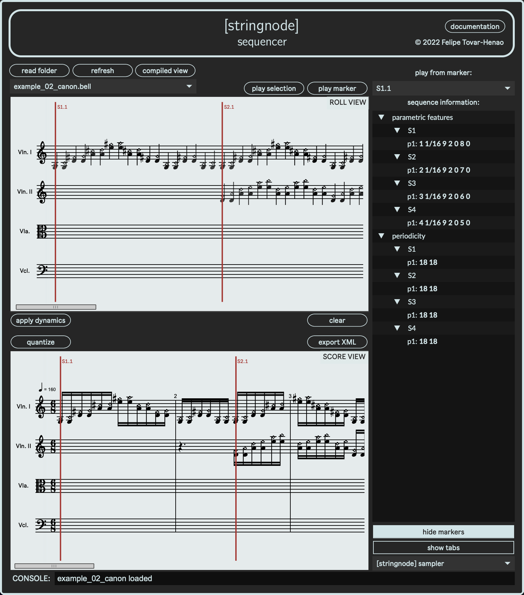

# **`[stringnode]` sequencer + sampler**

### _Computer-assisted composition tool for string node pattern sequencing and playback_

### © 2021-22 Felipe Tovar-Henao

<div style="text-align:center"></div>

\
`[stringnode]` is a computer-assisted composition tool, specifically developed for the writing of _«...como la pólvora...» (2022) attractors for amplified string quartet_. It consists of two parts, a MaxMSP patch/app and M4L audio device, for sequencing and playback of undulating, harmonic-touch fingering patterns. The pattern sequencing is done through `.bell` scripts containing the instructions for how to build each pattern sequence.

Click <a href="https://youtu.be/AbRYDJeTeQQ" target="_blank" rel="noopener noreferrer">here</a> for an early version preview of `[stringnode]`.

---

### `[stringnode]` sampler

<div style="text-align:center"></div>

`[stringnode]` sampler is a simple _MaxForLive_ device that receives playback information from the sequencer via OSC messages. To use the sampler, simply drag it into 4 separate _Ableton Live_ audio tracks, and assign a different string instrument for each of them.

_NOTE: the OSC port (3000) is hard-coded into both the sampler and sequencer._

---

### `[stringnode]` sequencer

<div style="text-align:center"></div>

`[stringnode]` sequencer transcribes pattern sequences from a given `.bell` script, using the MaxMSP package `bach`. All string and fingering patterns are arbitrarily set to have a triangular wave shape.
To load a script, select a folder containing `.bell` files and choose the script using the sequencer's menu. To play a specific pattern use the marker menu.

For convenience, the sequencer also diplays two streams of information about each sequence:

- The parametric features of each pattern (see **`<pattern>` format** section below), as a list:

```python
<voices> <beat_unit> <num_strings> <num_bows> <hop_size> <reps> <gap>
```

- The periodicity, with its 1st derivative, for each pattern.

For some examples, take a look at the `bell_scripts` folder.

---

### `.bell` scripts

<div style="text-align:center"></div>

The structure of a `.bell` script is hierarchical, and can include 4 different blocks of information at the main level — pattern _sequences_, _tempo_ changes, _fret_ structures, and _quantization_ information. The general structure of a script using all 4 types of main-level blocks would look something like this:

```python
[ `tempo <BPM> ]
[ `frets <fret_list> ]
[ `seq <seq_onset_1>
    [<pattern_1>]
    [<pattern_2>]
]
[ `seq <seq_onset_2>
    [<pattern_1>]
    [<pattern_2>]
]
[ `quantization
    [<quantization_info>]
]
```

Notice that each main-level element starts with a keyword, prepended with a backtick (`` ` ``)
The formats for each element in the previous example are explained below:

---

### `.bell` script elements and formats

- **`<tempo>` format** (_optional_): `<tempo>` is specified as a quarter note BPM value. More than one `<tempo>` can be included in the same script to change the tempo of individual `<seq>` or `<pattern>` elements. If not specified, the default is `120`. For instance:

```python
[ `tempo 130]
```

- **`<frets>` format** (_optional_): `<frets>` are specified as a list of integers, which determines the available fingerings in semitones for the patterns in all 4 instruments. For instance `` `frets 0 2 3 5 7 8 10 12`` would result in a minor scale _within each and all strings_. The maximum fret value supported for playback with `[stringnode]` sampler is `12`. More than one `<frets>` element can be included in the same script to change the fretting of individual `<seq>` or `<pattern>` elements. If not specified, the default fretting is `(0 2 4 5 7 9 11 12)`. For instance:

```python
[ `frets 0 2 3 5 6 8 9 11 12]
```

- **`<seq>` format**: a `<seq>` is a list containing a consecutive series of one or more `<pattern>` elements (and optionally `<tempo>` and/or `<fret>` elements), all preceded by the `` `seq `` keyword and the onset for the entire `<seq>`. More than one `<seq>` can be included in the same script. For instance:

```python
[ `seq 0
    [[3]    [2]     [0]     1/16    4   2   0   2   0 ]
    [[3]    [2]     [0]     1/16    3   3   0   2   0 ]
]
[ `seq 1/4
    [[1]    [2]     [0]     1/16    2   4   0   2   0 ]
    [[1]    [2]     [0]     1/16    3   3   0   2   0 ]
]
```

or changing tempo within a sequence:

```python
[ `seq 0
	[ `tempo 120 ]
	[[2]    [3]     [0]     1/16    2   2   0   2   0 ]
	[ `tempo 130 ]
	[[2]    [3]     [0]     1/16    2   2   0   2   0 ]
	[ `tempo 140 ]
	[[2]    [3]     [0]     1/16    2   2   0   2   0 ]
]
```

_NOTE: the sequence `<onset>` is specified as a tempo-relative unit — e.g. 3/4, 5/8, etc._

- **`<pattern>` format**: each `<pattern>` is built from 9 parameters, in the following order:

  - A list of `<instr_ids>`, specifying which instruments are playing the pattern. The indices range from 1 to 4, corresponding to violin I, violin II, viola, and cello, respectively.
  - A list of `<fret_positions>`, specifying the starting position for the pattern, for each voice/instrument. The number of positions must match the number of `<instr_ids>`.
  - A list of `<string_offsets>`, specifying the offset for the initial string in the pattern, for each voice/instrument. The number of string offsets must match the number of `<instr_ids>`. By default, all patterns start on string 4.
  - The tempo-relative `<beat_unit>` for all values in the pattern — e.g. 1/16, 1/8, 1/4, etc.
  - The number of strings (`<num_strings>`) used in the pattern.
  - The number of bowings (`<num_bows>`) per string.
  - The amount of beat rests around the center of the pattern (`<hop_size>`), when using more than 1 voice.
  - The amount of repetitions (`<reps>`) for the pattern.
  - The tempo-relative beat unit for the rest (`<gap>`) separating the current `<pattern>` from the next.

  For instance:

```python
##  instr_id    posns   str_offset  beat    numstr  bows    hopsize reps    gap
    [[3]        [2]     [0]         1/16    4       2       0       2       0 ]
```

- **`<quantization>` format** (_optional_): `<quantization`> is a list specifying _tempo_, _time signature(s)_, and _number of bars_ for each time signature, when a specific metric configuration is needed. For instance:

```python
[ `quantization
    ## tempo
    [120
    ##  time_sig    num_bars
        [4 4        1]
        [6 8        2]
    ]
    [160
        [3 4        3]
        [9 16       4]
    ]
]
```

Finally, note that any `bell`-compatible synthax can be used to algorithmically generate sequences and/or patterns — e.g. _for/while loops, native and user-defined functions, variable assignment, comments_, etc. For instance:

```python
## [stringnode] bell script example

[ `tempo 150]
[ `frets 0 1 3 4 6 7 9 10 12]
[ `seq 0
    ($bows = 1...6;
    for $b $i in $bows collect
        ($unit = ($i%3)+1;
        [[1...3] [3 :* 3] [rev(0...2)] $unit/16 2 $b 0 1 0])
    )
]
```
---
### **License**

`[stringnode]` is distributed under the terms of the GNU General Public License version 3 (GPL-v3.0).

---
### **Dependencies**
`[stringnode]` was developed using the following third-party dependencies:
- [`bach`](https://www.bachproject.net/) (v0.8.1.4)
